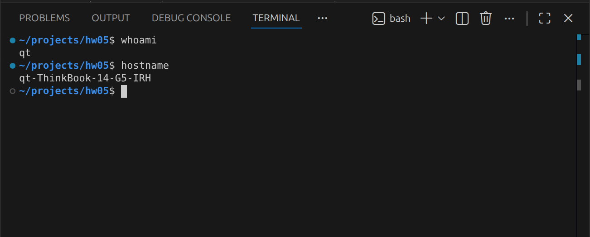

# Báo cáo phần cứng — môi trường chạy kiểm thử

*(HW05 mục 6:93 — "a hardware report (a dxdiag / screenfetch screenshot and a spec table)")*
*(HW05 mục 11:151 — "The hardware report, whose hostname matches your previous homework deployments")*

**Sinh viên:** Lý Quốc Thạnh — 23127262
**Xuất lúc:** 2026-08-17T09:29:31+07:00

## Ảnh chụp màn hình

| Ảnh | File | Trạng thái |
|---|---|---|
| `hostname` + `whoami` | `hostname-whoami.png` | ✅ |
| Thông tin hệ thống (`fastfetch`) | `fastfetch.png` | ⬜ chưa chụp |

### Định danh máy — ảnh chụp trực tiếp



Máy này không có `screenfetch` hay `neofetch`; dùng **`fastfetch`** (bản thay thế hiện đại, cùng
công dụng) để chụp ảnh thông tin hệ thống:

```bash
fastfetch
```

## Định danh máy — dùng để đối chiếu với HW04

| Trường | Giá trị |
|---|---|
| **hostname** | `qt-ThinkBook-14-G5-IRH` |
| **user** | `qt` |
| Kiến trúc | `x86_64` |

## Cấu hình

| Thành phần | Giá trị |
|---|---|
| CPU | 13th Gen Intel(R) Core(TM) i5-13500H |
| Nhân / luồng | 12 nhân vật lý · 16 luồng |
| Xung nhịp tối đa | 4700 MHz |
| Cache L3 | 18 MiB (1 instance) |
| RAM | 30Gi tổng · 23Gi khả dụng |
| Đĩa (phân vùng gốc) | 251G tổng · 154G trống |
| Hệ điều hành | Ubuntu 26.04 LTS |
| Kernel | 7.0.0-29-generic |

## Phần mềm dùng để đo

| Công cụ | Phiên bản | Vai trò |
|---|---|---|
| Apache JMeter | 5.6.3 | Sinh tải, chế độ non-GUI |
| OpenJDK | 21.0.12 | Chạy JMeter |
| Node.js | 22.22.1 | Chạy backend SUT |
| Python | 3.14.4 | Phân tích `.jtl` thô |
| htop | 3.4.1 | Theo dõi tài nguyên (quan sát) |
| `/proc/<pid>/stat` | — | Theo dõi tài nguyên (định lượng) |

## Ghi chú

- JMeter và JDK cài dạng **portable** trong `tools/`, nạp qua `env.sh` — máy không có quyền `sudo`
  không mật khẩu. Xem `Not-Run.md` mục 1.
- Backend SUT chạy trên **chính máy này** (`localhost:3000`), không qua mạng — nên độ trễ đo được
  **không bao gồm độ trễ mạng**. Đây là giới hạn cần nêu khi diễn giải số liệu.
- Máy dùng riêng cho bài đo, không chạy tác vụ nặng khác trong lúc bắn tải.
