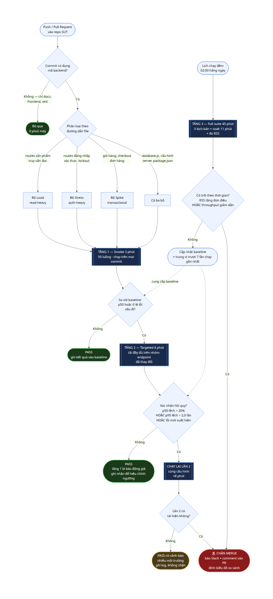

# Task 3 - Mô hình Kiểm thử Hiệu năng Liên tục

**Sinh viên:** Lý Quốc Thạnh - 23127262
**SUT:** EShop backend API - https://github.com/ttbhanh/eshop-sut

> Đề yêu cầu ba khâu - *"watches the SUT's commits, decides whether to run performance tests, and
> flags p95 regressions"* - kèm **flow chart** và bàn **trade-off (chi phí, báo động giả)**.

Toàn bộ ngưỡng trong tài liệu này **suy ra từ số liệu đo được ở Task 1**, không lấy từ thực hành
chung chung. Mỗi con số đều dẫn nguồn về file `.jtl` cụ thể.

---

## 1. Vấn đề: vì sao ngưỡng đặt theo cảm tính sẽ hỏng

Trước khi thiết kế mô hình, phải trả lời một câu: **hệ thống dao động bao nhiêu khi không có gì
thay đổi?** Nếu không biết con số này thì mọi ngưỡng cảnh báo đều là đoán mò.

Đo trên lượt soak `soak-20260813T010601Z.jtl` - cùng một commit, cùng một máy, cùng một mức tải
1 000 luồng, chạy liên tục 11 phút:

| Phút | 1 | 2 | 3 | 4 | 5 | 6 | 7 | 8 | 9 | 10 |
|---|---|---|---|---|---|---|---|---|---|---|
| **p50** | 2 | 2 | 2 | 2 | 2 | 2 | 2 | 2 | 2 | 2 |
| **p95** | 6 | 6 | 8 | 9 | **10** | **11** | 9 | 8 | 8 | 9 |
| **p99** | 9 | 9 | 12 | 13 | 31 | 24 | 22 | 20 | 17 | 22 |

```bash
# lệnh tái tạo bảng trên
python3 scripts/jtl-stats.py timeline results/raw/soak-20260813T010601Z.jtl 60
```

**Ba kết luận quyết định toàn bộ thiết kế bên dưới:**

| Quan sát | Con số | Hệ quả cho mô hình |
|---|---|---|
| p95 dao động trong cùng một lượt chạy | 6 -> 11 ms, **tỉ lệ 1,83 lần** | Mọi ngưỡng kiểu *"p95 tăng quá 50% thì báo động"* sẽ **tự kêu với chính nó** dù không ai sửa một dòng code |
| p50 hoàn toàn bất biến | **2 ms** ở cả 10 phút | p50 là tín hiệu nhiễu thấp nhất - phải dùng làm tín hiệu chính, không phải p95 |
| p99 nhiễu nặng nhất | 9 -> 31 ms, **tỉ lệ 3,4 lần** | p99 chỉ dùng để chẩn đoán sau khi đã có cảnh báo, không dùng làm cò súng |

Đây chính là câu trả lời định lượng cho vế "false alarms" mà đề hỏi: **báo động giả không phải rủi
ro lý thuyết, nó là hệ quả toán học nếu đặt ngưỡng thấp hơn 1,83 lần.**

---

## 2. Flow chart

```mermaid
flowchart TD
    A([Push / Pull Request<br/>vào repo SUT]) --> B{Commit có đụng<br/>mã backend?}

    B -->|"Không - chỉ docs,<br/>frontend, test"| Z0([Bỏ qua<br/>0 phút máy])
    B -->|Có| C{Phân loại theo<br/>đường dẫn file}

    C -->|"routes sản phẩm<br/>truy vấn đọc"| D1[Bộ Load<br/>read-heavy]
    C -->|"routes đăng nhập<br/>xác thực, lockout"| D2[Bộ Stress<br/>auth-heavy]
    C -->|"giỏ hàng, checkout<br/>đơn hàng"| D3[Bộ Spike<br/>transactional]
    C -->|"database.js, cấu hình<br/>server, package.json"| D4[Cả ba bộ]

    D1 --> E
    D2 --> E
    D3 --> E
    D4 --> E

    E[["TẦNG 1 - Smoke 3 phút<br/>50 luồng - chạy trên mọi commit"]] --> F{So với baseline:<br/>p50 hoặc tỉ lệ lỗi<br/>xấu đi?}

    F -->|Không| G0([PASS<br/>ghi kết quả vào baseline])
    F -->|Có| H[["TẦNG 2 - Targeted 8 phút<br/>tải đầy đủ trên nhóm endpoint<br/>đã thay đổi"]]

    H --> I{Xác nhận hồi quy?<br/>p50 lệch > 20%<br/>HOẶC p95 lệch > 2,0 lần<br/>HOẶC lỗi mới xuất hiện}

    I -->|Không| G1([PASS<br/>tầng 1 là báo động giả<br/>ghi nhận để hiệu chỉnh ngưỡng])
    I -->|Có| J[["CHẠY LẠI LẦN 2<br/>cùng cấu hình<br/>+8 phút"]]

    J --> K{Lần 2 có<br/>tái hiện không?}

    K -->|Không| G2([PASS có cảnh báo<br/>nhiễu môi trường<br/>ghi log, không chặn])
    K -->|Có| L([[!] CHẶN MERGE<br/>báo Slack + comment vào PR<br/>đính biểu đồ so sánh])

    M([Lịch chạy đêm<br/>02:00 hằng ngày]) --> N[["TẦNG 3 - Full suite 45 phút<br/>3 kịch bản + soak 11 phút<br/>+ đo RSS"]]
    N --> O{Có trôi theo thời gian?<br/>RSS tăng đơn điệu<br/>HOẶC throughput giảm dần}
    O -->|Có| L
    O -->|Không| P([Cập nhật baseline<br/>= trung vị trượt 7 lần chạy gần nhất])
    P -.->|"cung cấp baseline"| F
    P -.-> I

    style L fill:#8b1a1a,stroke:#f85149,color:#fff
    style Z0 fill:#1a3a1a,stroke:#3fb950,color:#fff
    style G0 fill:#1a3a1a,stroke:#3fb950,color:#fff
    style G1 fill:#1a3a1a,stroke:#3fb950,color:#fff
    style G2 fill:#4a3a1a,stroke:#d29922,color:#fff
    style E fill:#1a2a4a,stroke:#58a6ff,color:#fff
    style H fill:#1a2a4a,stroke:#58a6ff,color:#fff
    style J fill:#1a2a4a,stroke:#58a6ff,color:#fff
    style N fill:#1a2a4a,stroke:#58a6ff,color:#fff
```

> **Bản ảnh:** [`evidence/diagrams/Task3-Continuous-Performance-Testing.png`](../../evidence/diagrams/Task3-Continuous-Performance-Testing.png)
> - GitHub render trực tiếp khối Mermaid ở trên, nhưng phần lớn công cụ xuất PDF thì không, nên
> sơ đồ được render sẵn thành PNG bằng `node scripts/render-mermaid.js`.



---

## 3. Khâu 1 - Theo dõi commit

### 3.1 Sự kiện kích hoạt

| Sự kiện | Hành động |
|---|---|
| `push` vào nhánh `main` | Chạy theo bảng định tuyến bên dưới |
| `pull_request` mở hoặc cập nhật | Chạy theo bảng định tuyến, kết quả comment vào PR |
| Lịch `cron` 02:00 hằng ngày | Chạy Tầng 3 đầy đủ, bất kể có commit hay không |
| Gắn nhãn `perf-test` thủ công | Chạy Tầng 2 theo yêu cầu |

Lượt chạy theo lịch đêm là **bắt buộc**, không phải tuỳ chọn: có những suy thoái chỉ lộ ra khi chạy
dài (rò rỉ bộ nhớ), mà không lượt chạy 3 phút nào bắt được.

### 3.2 Định tuyến theo đường dẫn file thay đổi

Không phải commit nào cũng đáng chạy test hiệu năng. Bảng định tuyến gắn **vùng mã nguồn** với
**nhóm endpoint** đã kiểm ở Task 1:

| File thay đổi | Bộ test chạy | Vì sao |
|---|---|---|
| `backend/server.js` - routes `/api/products` | **Load** (read-heavy) | Đường đọc, đã có baseline 997 req/s |
| `backend/server.js` - routes `/api/login`, `/api/register` | **Stress** (auth-heavy) | Đường xác thực, đã biết điểm gãy |
| `backend/server.js` - routes `/api/cart`, `/api/checkout`, `/api/orders` | **Spike** (transactional) | Đường ghi CSDL |
| `backend/database.js`, `package.json`, `package-lock.json` | **Cả ba** | Đổi schema hoặc thư viện ảnh hưởng toàn hệ thống |
| `frontend-*/**`, `*.md`, `docs/**` | **Không chạy** | Không đụng tới backend |

Vì toàn bộ route của SUT nằm trong **một file duy nhất** `server.js` (572 dòng), định tuyến phải
dựa vào **dòng bị thay đổi** chứ không chỉ tên file:

```bash
# lấy các dòng đã đổi, đối chiếu với dải dòng của từng nhóm route
git diff --unified=0 HEAD~1 HEAD -- backend/server.js \
  | grep -oP '^@@ -\d+(,\d+)? \+\K\d+' \
  | while read line; do
      if   [ "$line" -ge 141 ] && [ "$line" -le 198 ]; then echo "load"
      elif [ "$line" -ge  20 ] && [ "$line" -le 110 ]; then echo "stress"
      elif [ "$line" -ge 284 ] && [ "$line" -le 355 ]; then echo "spike"
      else echo "all"; fi
    done | sort -u
```

**Điểm yếu phải thừa nhận:** cách này giòn - chỉ cần chèn thêm 20 dòng ở đầu file là mọi dải dòng
lệch hết. Đây là hệ quả của việc SUT gom tất cả vào một file. Với codebase tách module bình thường
thì định tuyến theo đường dẫn file là đủ và bền. Giải pháp trung gian: định tuyến theo **tên hàm
route** trích từ diff (`app.post("/api/login"`) thay vì theo số dòng.

---

## 4. Khâu 2 - Quyết định chạy bộ nào

### 4.1 Ba tầng, đánh đổi giữa độ phủ và chi phí

| Tầng | Khi nào chạy | Cấu hình | Thời lượng | Phát hiện được | **Không** phát hiện được |
|---|---|---|---|---|---|
| **0 - Bỏ qua** | Commit không đụng backend | - | **0 phút** | - | - |
| **1 - Smoke** | Mọi commit đụng backend | 50 luồng, 2 phút, nhóm endpoint liên quan | **~3 phút** | Suy thoái thô (chậm gấp đôi, lỗi mới, endpoint chết) | Suy thoái nhẹ - vấn đề chỉ lộ ở tải cao - rò rỉ bộ nhớ |
| **2 - Targeted** | Tầng 1 nghi ngờ, hoặc PR gắn nhãn | Tải đầy đủ theo kịch bản của nhóm đó | **~8 phút** | Dịch chuyển điểm gãy - thay đổi đường cong bão hoà | Rò rỉ tích luỹ chậm |
| **3 - Full** | Đêm + trước khi phát hành | 3 kịch bản + soak 11 phút + đo RSS | **~45 phút** | Rò rỉ bộ nhớ - trôi hiệu năng - hồi quy trên nhóm không đổi mã | - |

Con số 45 phút không phải ước lượng - đó là **tổng thời lượng thật của 8 lượt chạy ở Task 1**:

```
load 5,0 - load-ramp 4,7 - soak 11,0 - spike 5,0
stress 5,5 + 7,8 + 6,3 - bottleneck-check 2,0     ->  TỔNG 47,3 phút
```

### 4.2 Nguyên tắc leo thang

Tầng 1 **không bao giờ tự chặn merge**. Nó chỉ có quyền **gọi Tầng 2**. Lý do nằm ở mục 1: với
nhiễu nền 1,83 lần, một lượt chạy 2 phút không đủ mẫu để phân biệt hồi quy thật với dao động ngẫu
nhiên. Cho Tầng 1 quyền chặn merge là cách nhanh nhất để cả đội mất niềm tin vào hệ thống cảnh báo.

---

## 5. Khâu 3 - Phát hiện hồi quy p95

### 5.1 Baseline là gì

**Trung vị trượt của 7 lượt chạy xanh gần nhất trên `main`**, tính riêng cho từng nhóm endpoint và
từng chỉ số.

Không dùng "lượt chạy trước đó" làm baseline: một lượt nhiễu sẽ vừa gây báo động giả, vừa **tự trở
thành baseline mới** và che mất hồi quy thật ở lượt kế tiếp. Trung vị 7 lượt chịu được 3 lượt nhiễu.

### 5.2 Ngưỡng - và vì sao đặt như vậy

| Chỉ số | Ngưỡng | Căn cứ từ số liệu Task 1 |
|---|---|---|
| **p50** | lệch > **20%** | p50 đo được **bất biến 2 ms** suốt 10 phút. Nhiễu gần như bằng 0, nên ngưỡng chặt được. Đây là **tín hiệu chính** |
| **p95** | lệch > **2,0 lần** | Nhiễu nền đo được là **1,83 lần**. Ngưỡng phải nằm **trên** mức đó, nếu không là báo động giả có bảo đảm. 2,0 chỉ vừa đủ vượt - đây là lý do p95 không thể làm tín hiệu chính |
| **Tỉ lệ lỗi** | tăng > **1 điểm phần trăm** so với baseline | Tuyệt đối **không** dùng ngưỡng tuyệt đối kiểu "lỗi > 1%". SUT hiện có 3,57% lỗi nền cố định do BUG-01 - ngưỡng tuyệt đối sẽ chặn **mọi** commit, vĩnh viễn |
| **Throughput** | giảm > **10%** | Soak cho thấy throughput ổn định trong biên độ **0,2%** (996,1-997,8 req/s). Đây là chỉ số ổn định thứ hai sau p50 |
| **RSS cuối lượt** | tăng > **20%** so với baseline, hoặc **tăng đơn điệu** trong lượt | Soak cho thấy RSS chững ở 161 MB. Còn kịch bản Spike cho thấy RSS **không nhả lại 19 MB** - đúng dạng tín hiệu cần bắt |

### 5.3 Vì sao không dùng riêng p95 như đề gợi ý

Đề nói *"flags p95 regressions"*, nhưng số liệu đo được cho thấy **p95 một mình là tín hiệu tồi**:
nó dao động 1,83 lần khi không có gì thay đổi. Mô hình này vẫn theo dõi p95 đúng như đề yêu cầu,
nhưng đặt nó trong một **tín hiệu tổ hợp** để giảm báo động giả:

```
CẢNH BÁO khi:  (p50 lệch > 20%)                    <- nhạy, nhiễu thấp, bắt suy thoái hệ thống
          HOẶC (p95 lệch > 2,0 lần)                <- theo đúng yêu cầu đề, ngưỡng nới theo nhiễu đo được
          HOẶC (tỉ lệ lỗi tăng > 1 đpt)            <- bắt hồi quy chức năng
          HOẶC (throughput giảm > 10%)             <- bắt suy giảm năng lực

VÀ tái hiện được ở lần chạy thứ hai              <- lọc nhiễu môi trường
```

### 5.4 Xác nhận bằng lần chạy thứ hai

Trước khi chặn merge, chạy lại **đúng cấu hình đó một lần nữa**. Đây là cơ chế lọc báo động giả rẻ
nhất: nếu xác suất một lượt nhiễu vượt ngưỡng là *p*, thì xác suất hai lượt liên tiếp cùng vượt là
*p^2* - với *p* = 10% thì báo động giả giảm từ 10% xuống **1%**.

Cái giá: **+8 phút** cho mỗi lần nghi ngờ. Rẻ hơn nhiều so với việc một kỹ sư mất nửa buổi điều tra
một cảnh báo không có thật.

### 5.5 Cảnh báo trông như thế nào

Comment tự động vào PR, kèm bảng so sánh và biểu đồ:

```
[!] Phát hiện hồi quy hiệu năng - nhóm read-heavy

                baseline (7 lượt)   PR này    thay đổi
p50                      2 ms        5 ms     +150%  [!] vượt ngưỡng 20%
p95                      8 ms       21 ms     +163%  [!] vượt ngưỡng 2,0 lần
throughput           997 req/s   612 req/s     -39%  [!] vượt ngưỡng 10%
tỉ lệ lỗi              3,57%       3,55%     -0,02đ  [x]
RSS cuối lượt          161 MB      158 MB       -2%  [x]

Đã tái hiện ở lần chạy thứ hai (run #4127 và #4128).
Commit nghi ngờ: a3f9c21 "refactor product search query"
Log thô: results/raw/ci-4127.jtl - results/raw/ci-4128.jtl
```

Ba yêu cầu bắt buộc với mọi cảnh báo:

1. **Luôn kèm baseline** - con số trần không nói lên điều gì
2. **Luôn kèm link tới `.jtl` thô** - người nhận phải tự kiểm chứng được
3. **Luôn nói rõ đã tái hiện hay chưa** - để người nhận biết mức độ tin cậy

---

## 6. Trade-off

### 6.1 Chi phí

Giả định một đội có **20 commit/ngày**, trong đó **12 commit** đụng backend:

| Hạng mục | Phép tính | Thời lượng máy |
|---|---|---|
| Tầng 0 - bỏ qua | 8 commit x 0 phút | 0 phút |
| Tầng 1 - smoke | 12 commit x 3 phút | 36 phút |
| Tầng 2 - leo thang | ~2 lần/ngày x 8 phút | 16 phút |
| Xác nhận lần 2 | ~1 lần/ngày x 8 phút | 8 phút |
| Tầng 3 - chạy đêm | 1 x 45 phút | 45 phút |
| **Tổng** | | **~105 phút/ngày ~ 1,75 giờ** |

Trên GitHub Actions runner tiêu chuẩn (khoảng 0,008 USD/phút), chi phí vào cỡ **0,84 USD/ngày ~
25 USD/tháng**. So với một kỹ sư mất nửa ngày truy một sự cố hiệu năng trên production, đây là mức
gần như miễn phí.

**Nhưng chi phí thật không nằm ở tiền máy** - nó nằm ở ba chỗ:

| Chi phí ẩn | Biểu hiện | Cách giảm |
|---|---|---|
| **Thời gian chờ của lập trình viên** | Thêm 3 phút vào mỗi vòng CI, nhân với số lần push | Chạy song song với unit test, không nối tiếp |
| **Công bảo trì** | Baseline lệch dần, ngưỡng phải hiệu chỉnh, test plan phải cập nhật khi API đổi | Xem lại ngưỡng theo quý, dựa trên tỉ lệ báo động giả thực tế |
| **Niềm tin của đội** | Vài cảnh báo sai là cả đội bắt đầu bỏ qua mọi cảnh báo | Thà bỏ sót còn hơn báo nhầm ở giai đoạn đầu |

### 6.2 Báo động giả

**Đây là rủi ro lớn nhất của mô hình, và bài này có số liệu để định lượng nó.**

Nhiễu nền đo được: p95 dao động **1,83 lần** trong cùng một lượt chạy. Vậy nếu đặt ngưỡng theo cảm
tính:

| Ngưỡng đặt | Điều gì xảy ra |
|---|---|
| p95 tăng > 20% | Báo động **liên tục** - phút 1 (6 ms) so phút 6 (11 ms) đã là +83% |
| p95 tăng > 50% | Vẫn báo động giả thường xuyên |
| p95 tăng > 100% (2,0 lần) | Vừa đủ vượt nhiễu 1,83 lần - **ngưỡng thấp nhất còn dùng được** |
| p95 tăng > 300% | An toàn nhưng bỏ sót gần hết hồi quy thật |

Bốn cơ chế giảm báo động giả trong mô hình này, xếp theo hiệu quả trên chi phí:

| Cơ chế | Giảm báo động giả | Cái giá |
|---|---|---|
| **Dùng p50 làm tín hiệu chính** | Rất cao - nhiễu gần bằng 0 so với 1,83 lần của p95 | Bỏ sót hồi quy chỉ ảnh hưởng phần đuôi phân phối |
| **Xác nhận bằng lần chạy thứ hai** | Cao - từ *p* xuống *p^2* | +8 phút mỗi lần nghi ngờ |
| **Baseline trung vị trượt 7 lượt** | Trung bình - chịu được 3 lượt nhiễu | Phản ứng chậm với thay đổi hợp lệ |
| **Ngưỡng đặt trên nhiễu đo được** | Nền tảng - không có nó thì ba cái trên vô nghĩa | Phải đo lại nhiễu khi đổi môi trường chạy |

### 6.3 Đánh đổi giữa bỏ sót và báo nhầm

Không có cách nào tối ưu cả hai. Mô hình này **cố ý nghiêng về phía bỏ sót**:

- Tầng 1 không có quyền chặn merge
- Ngưỡng p95 nới tới 2,0 lần
- Phải tái hiện ở lần chạy thứ hai mới chặn

Lý do: một hồi quy hiệu năng bị bỏ sót sẽ được lượt chạy đêm hoặc lượt trước phát hành bắt lại. Còn
một hệ thống cảnh báo bị mất niềm tin thì **không có cơ chế nào cứu** - người ta chỉ đơn giản là
ngừng đọc nó.

### 6.4 Giới hạn của chính mô hình này

Phải nói rõ để không bán quá lời:

| Giới hạn | Ảnh hưởng |
|---|---|
| **Nhiễu 1,83 lần đo trên máy cá nhân rảnh rỗi** | CI runner dùng chung ồn hơn nhiều. Phải **đo lại nhiễu nền trên chính runner đó** trước khi áp ngưỡng, nếu không mọi con số ở mục 5.2 đều sai |
| **Baseline gắn với môi trường** | Đổi loại runner là baseline vô hiệu, phải dựng lại từ đầu |
| **Không bắt được hồi quy dưới ngưỡng nhiễu** | Một thay đổi làm chậm 10% sẽ lọt lưới cho tới khi tích luỹ đủ lớn |
| **Định tuyến theo dải dòng rất giòn** | Hệ quả của việc SUT gom mọi route vào một file (xem mục 3.2) |
| **Soak 11 phút chỉ chạy trên đường đọc** | Rò rỉ `userCarts` (PERF-01) nằm ở đường **ghi** - muốn bắt thì Tầng 3 phải có thêm một lượt soak trên `POST /api/cart` |

---

## 7. Triển khai - GitHub Actions

```yaml
name: continuous-performance-testing

on:
  push:        { branches: [main] }
  pull_request: {}
  schedule:    [{ cron: '0 19 * * *' }]   # 02:00 giờ VN

jobs:
  route:
    runs-on: ubuntu-latest
    outputs:
      suites: ${{ steps.pick.outputs.suites }}
      tier:   ${{ steps.pick.outputs.tier }}
    steps:
      - uses: actions/checkout@v4
        with: { fetch-depth: 2 }
      - id: pick
        run: ./scripts/ci/route-commit.sh   # xem mục 3.2

  perf:
    needs: route
    if: needs.route.outputs.suites != ''
    runs-on: ubuntu-latest
    strategy:
      matrix:
        suite: ${{ fromJSON(needs.route.outputs.suites) }}
    steps:
      - uses: actions/checkout@v4
      - run: ./scripts/reset-db.sh && node scripts/seed-data.js
      - run: |
          source env.sh
          jmeter -n -t plans/23127262_${{ matrix.suite }}_*.jmx \
                 -Jthreads=${{ needs.route.outputs.tier == '1' && 50 || 250 }} \
                 -l results/raw/ci-${{ github.run_number }}.jtl
      - run: python3 scripts/jtl-stats.py summary results/raw/ci-${{ github.run_number }}.jtl
      - run: ./scripts/ci/compare-baseline.py   # ngưỡng ở mục 5.2
      - uses: actions/upload-artifact@v4
        with:
          name: perf-${{ matrix.suite }}-${{ github.run_number }}
          path: results/
```

Ba script cần viết thêm - đều **chưa có**, đây là đề xuất chứ không phải phần đã triển khai:

| Script | Việc |
|---|---|
| `scripts/ci/route-commit.sh` | Đọc diff, quyết định chạy bộ nào và tầng nào |
| `scripts/ci/compare-baseline.py` | So kết quả với baseline trung vị trượt, áp ngưỡng mục 5.2 |
| `scripts/ci/post-comment.sh` | Dựng comment PR như mẫu ở mục 5.5 |

Hai script **đã có sẵn từ Task 1** và dùng lại được nguyên vẹn: `scripts/jtl-stats.py` để trích số
liệu, và `scripts/reset-db.sh` để đưa CSDL về trạng thái sạch trước mỗi lượt.

---

## 8. Kết luận

Điều làm mô hình này khác một bản đề xuất chung chung là nó **bắt đầu từ việc đo nhiễu chứ không
phải từ việc chọn ngưỡng**. Con số 1,83 lần dao động của p95 - đo trên chính hệ thống này, cùng
một commit, cùng một máy - quyết định gần như toàn bộ thiết kế:

- Nó loại p95 khỏi vai trò tín hiệu chính, nhường chỗ cho p50 vốn bất biến ở 2 ms
- Nó đặt sàn cho ngưỡng cảnh báo p95 ở mức 2,0 lần, không thể thấp hơn
- Nó là lý do phải có bước xác nhận bằng lần chạy thứ hai
- Nó giải thích vì sao Tầng 1 không được phép chặn merge

Nếu bỏ qua bước đo nhiễu và đặt ngưỡng theo trực giác - chẳng hạn "p95 tăng 20% thì báo" - hệ thống
sẽ báo động ở gần như mọi lượt chạy, và trong vòng một tuần sẽ không còn ai đọc cảnh báo nữa.

**Một hệ thống cảnh báo bị bỏ qua thì tệ hơn là không có hệ thống nào** - vì nó tiêu tốn chi phí máy
và công bảo trì mà không đổi lấy được gì.
